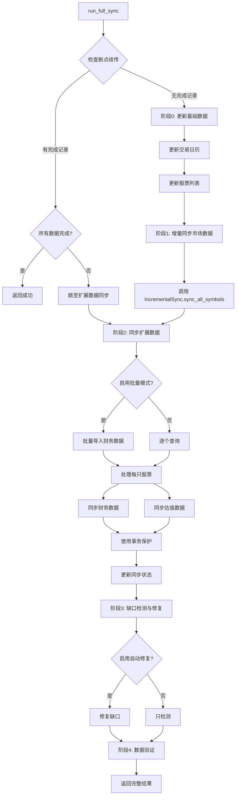
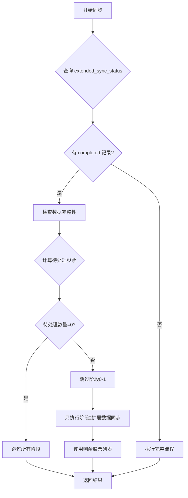

# Full-Sync 设计文档

## 概述

Full-Sync 是 SimTradeData 同步系统的核心入口方法 `run_full_sync()`，它协调多个子组件完成完整的数据同步流程。设计采用分阶段执行、智能断点续传、批量优化等策略，确保高性能、高可靠性的数据同步。

本设计基于现有的 `simtradedata/sync/manager.py` 实现，遵循 SimTradeData 的零冗余架构和数据同步规范。

## 指导文档对齐

### 技术标准 (tech.md)

1. **Python 3.12+**: 使用现代 Python 特性（类型注解、上下文管理器）
2. **SQLite 数据库**: 零冗余的 11 表架构
3. **分层架构**:
   - 数据同步层: `SyncManager`
   - 数据源层: `DataSourceManager`
   - 数据处理层: `DataProcessingEngine`
   - 数据库层: `DatabaseManager`
4. **Poetry 项目管理**: 依赖管理和虚拟环境
5. **pytest 测试框架**: 100% 测试覆盖目标

### 项目结构 (structure.md)

Full-Sync 位于数据同步层，文件结构：

```
simtradedata/
├── sync/
│   ├── manager.py          # SyncManager.run_full_sync() - 主入口
│   ├── incremental.py      # IncrementalSync - 增量同步子组件
│   ├── gap_detector.py     # GapDetector - 缺口检测子组件
│   └── validator.py        # DataValidator - 数据验证子组件
├── data_sources/
│   ├── manager.py          # DataSourceManager - 多数据源管理
│   ├── mootdx_adapter.py   # Mootdx 适配器
│   ├── baostock_adapter.py # BaoStock 适配器
│   └── qstock_adapter.py   # QStock 适配器
├── preprocessor/
│   └── engine.py           # DataProcessingEngine - 数据预处理
└── database/
    └── manager.py          # DatabaseManager - 数据库操作
```

## 代码复用分析

### 现有组件复用

1. **BaseManager** (`core/base_manager.py`)
   - 提供配置管理、日志管理、性能监控基础功能
   - SyncManager 继承并扩展

2. **IncrementalSync** (`sync/incremental.py`)
   - 复用：增量同步市场数据逻辑
   - 方法：`sync_all_symbols(target_date, symbols, frequencies)`

3. **GapDetector** (`sync/gap_detector.py`)
   - 复用：缺口检测和分析逻辑
   - 方法：`detect_all_gaps(start_date, end_date, symbols, frequencies)`

4. **DataValidator** (`sync/validator.py`)
   - 复用：数据质量验证逻辑
   - 方法：`validate_all_data(start_date, end_date, symbols, frequencies)`

5. **DataSourceManager** (`data_sources/manager.py`)
   - 复用：多数据源管理和故障转移
   - 方法：`get_fundamentals()`, `get_valuation_data()`, `get_trade_calendar()`, `get_stock_info()`, `batch_import_financial_data()`

6. **DataProcessingEngine** (`preprocessor/engine.py`)
   - 复用：数据清洗、验证、标准化
   - 方法：`process_symbol_data(symbol, start_date, end_date, frequency)`

7. **DatabaseManager** (`database/manager.py`)
   - 复用：数据库操作和事务管理
   - 方法：`execute()`, `executemany()`, `fetchone()`, `fetchall()`, `transaction()`

8. **进度条工具** (`utils/progress_bar.py`)
   - 复用：分阶段进度显示
   - 函数：`create_phase_progress()`, `log_phase_start()`, `log_phase_complete()`

### 集成点

1. **数据库集成**
   - 表：`trading_calendar`, `stocks`, `market_data`, `financials`, `valuations`, `extended_sync_status`
   - 事务：使用 `db_manager.transaction()` 上下文管理器

2. **数据源集成**
   - Mootdx: 批量财务数据导入（主数据源）
   - BaoStock: 交易日历和股票列表
   - QStock: 备用数据源

3. **配置集成**
   - 从 `config.yaml` 读取配置
   - 支持的配置项：`auto_gap_fix`, `enable_validation`, `max_gap_fix_days`, `batch_size`

## 架构设计

### 模块化设计原则

1. **单一职责**: 每个方法专注一个任务
   - `_update_trading_calendar()`: 只更新交易日历
   - `_update_stock_list()`: 只更新股票列表
   - `_sync_extended_data()`: 只同步扩展数据
   - `_sync_single_symbol_with_transaction()`: 只处理单只股票

2. **组件隔离**: 子组件独立且可测试
   - `IncrementalSync`: 独立的增量同步逻辑
   - `GapDetector`: 独立的缺口检测逻辑
   - `DataValidator`: 独立的验证逻辑

3. **服务层分离**:
   - 数据访问: `DatabaseManager`
   - 业务逻辑: `SyncManager`
   - 数据获取: `DataSourceManager`
   - 数据处理: `DataProcessingEngine`

### 执行流程架构



### 断点续传架构



## 核心组件与接口

### 组件 1: SyncManager

**目的**: 完整同步流程的协调器和入口

**公共接口**:
```python
@unified_error_handler(return_dict=True)
def run_full_sync(
    self,
    target_date: Optional[date] = None,
    symbols: Optional[List[str]] = None,
    frequencies: Optional[List[str]] = None,
) -> Dict[str, Any]:
    """
    运行完整同步流程

    Returns:
        {
            "target_date": str,
            "start_time": str,
            "end_time": str,
            "duration_seconds": float,
            "phases": {
                "calendar_update": {...},
                "stock_list_update": {...},
                "incremental_sync": {...},
                "extended_data_sync": {...},
                "gap_detection": {...},
                "validation": {...}
            },
            "summary": {
                "total_phases": int,
                "successful_phases": int,
                "failed_phases": int
            }
        }
    """
```

**依赖**:
- `DatabaseManager`: 数据库操作
- `DataSourceManager`: 数据源管理
- `DataProcessingEngine`: 数据处理
- `IncrementalSync`: 增量同步子组件
- `GapDetector`: 缺口检测子组件
- `DataValidator`: 数据验证子组件

**复用**: `BaseManager` 提供的配置管理、日志管理、性能监控

### 组件 2: 基础数据更新

**私有方法**:
```python
def _update_trading_calendar(self, target_date: date) -> Dict[str, Any]:
    """
    增量更新交易日历

    策略：
    - 检查现有数据范围
    - 只更新缺失的年份（target_date ± 1年）
    - 批量插入优化

    Returns:
        {
            "status": "completed" | "skipped",
            "start_year": int,
            "end_year": int,
            "updated_records": int,
            "total_records": int
        }
    """

def _update_stock_list(self, target_date: Optional[date] = None) -> Dict[str, Any]:
    """
    增量更新股票列表

    策略：
    - 检查是否今日已更新
    - 使用 BaoStock 获取目标日期的股票列表
    - 过滤指数代码
    - 批量更新/插入优化

    Returns:
        {
            "status": "completed" | "skipped" | "failed",
            "total_stocks": int,
            "new_stocks": int,
            "updated_stocks": int,
            "failed_stocks": int
        }
    """
```

**依赖**:
- `DataSourceManager.get_trade_calendar()`
- `DataSourceManager.get_stock_info()`
- `DatabaseManager` 批量操作

### 组件 3: 扩展数据同步

**私有方法**:
```python
def _sync_extended_data(
    self,
    symbols: List[str],
    target_date: date,
    progress_bar=None
) -> Dict[str, Any]:
    """
    增量同步扩展数据（财务、估值）

    策略：
    - 批量模式判断（待处理 >= 50 或 总库存 >= 500）
    - 批量导入财务数据（mootdx）
    - 逐个同步估值数据
    - 使用事务保护

    Returns:
        {
            "financials_count": int,
            "valuations_count": int,
            "indicators_count": int,
            "processed_symbols": int,
            "failed_symbols": int,
            "session_id": str,
            "batch_mode": bool
        }
    """

def _sync_single_symbol_with_transaction(
    self,
    symbol: str,
    target_date: date,
    session_id: str,
    preloaded_financial: Optional[Dict[str, Any]] = None,
) -> Dict[str, Any]:
    """
    使用事务保护同步单只股票的扩展数据

    事务内操作：
    1. 标记 processing 状态
    2. 同步财务数据（优先使用预加载数据）
    3. 同步估值数据
    4. 根据结果更新状态（completed/partial/failed）

    Returns:
        {
            "success": bool,
            "financials_count": int,
            "valuations_count": int,
            "indicators_count": int
        }
    """
```

**依赖**:
- `DataSourceManager.batch_import_financial_data()`
- `DataSourceManager.get_fundamentals()`
- `DataSourceManager.get_valuation_data()`
- `DatabaseManager.transaction()`

### 组件 4: 断点续传管理

**私有方法**:
```python
def _get_extended_data_symbols_to_process(
    self,
    symbols: List[str],
    target_date: date
) -> List[str]:
    """
    获取需要处理扩展数据的股票列表（智能断点续传）

    策略：
    1. 清理过期 pending 状态（>1天）
    2. 智能完整性检查：
       - 财务数据：最近2年年报
       - 估值数据：目标日期前后10天
       - 同步状态：completed 记录
    3. 自动修复状态不一致
    4. 返回待处理股票列表

    Returns:
        待处理的股票代码列表
    """
```

**依赖**: `DatabaseManager` 复杂查询

### 组件 5: 缺口修复

**私有方法**:
```python
def _auto_fix_gaps(self, gap_result: Dict[str, Any]) -> Dict[str, Any]:
    """
    自动修复缺口

    策略：
    - 限制修复数量（最大10个）
    - 验证缺口在上市日期之后
    - 跳过新股和停牌股的缺口
    - 使用数据处理引擎填补缺口

    Returns:
        {
            "total_gaps": int,
            "attempted_fixes": int,
            "successful_fixes": int,
            "failed_fixes": int,
            "skipped_fixes": int
        }
    """
```

**依赖**:
- `GapDetector.detect_all_gaps()`
- `DataSourceManager.get_daily_data()`
- `DataProcessingEngine.process_symbol_data()`

## 数据模型

### extended_sync_status 表

同步状态追踪表，用于断点续传：

```sql
CREATE TABLE extended_sync_status (
    id INTEGER PRIMARY KEY AUTOINCREMENT,
    symbol TEXT NOT NULL,                -- 股票代码
    sync_type TEXT NOT NULL,             -- 同步类型: processing/financial/valuation
    target_date TEXT NOT NULL,           -- 目标日期
    status TEXT NOT NULL,                -- 状态: pending/processing/completed/partial/failed
    records_count INTEGER DEFAULT 0,     -- 同步的记录数
    session_id TEXT,                     -- 会话ID
    created_at TEXT NOT NULL,            -- 创建时间
    updated_at TEXT NOT NULL,            -- 更新时间
    UNIQUE(symbol, target_date)          -- 每只股票每天只有一条记录
);
```

### 同步结果数据模型

```python
{
    "target_date": "2025-01-24",
    "start_time": "2025-01-24T10:00:00",
    "end_time": "2025-01-24T10:30:00",
    "duration_seconds": 1800.5,
    "phases": {
        "calendar_update": {
            "status": "completed",
            "start_year": 2024,
            "end_year": 2026,
            "updated_records": 730,
            "total_records": 3650
        },
        "stock_list_update": {
            "status": "completed",
            "total_stocks": 5000,
            "new_stocks": 10,
            "updated_stocks": 4990,
            "failed_stocks": 0
        },
        "incremental_sync": {
            "status": "completed",
            "result": {
                "total_symbols": 5000,
                "success_count": 4950,
                "error_count": 50
            }
        },
        "extended_data_sync": {
            "status": "completed",
            "result": {
                "financials_count": 4800,
                "valuations_count": 4900,
                "indicators_count": 0,
                "processed_symbols": 5000,
                "failed_symbols": 100,
                "batch_mode": true
            }
        },
        "gap_detection": {
            "status": "completed",
            "result": {
                "summary": {
                    "total_gaps": 15
                }
            }
        },
        "gap_fix": {
            "status": "completed",
            "result": {
                "total_gaps": 15,
                "attempted_fixes": 10,
                "successful_fixes": 8,
                "failed_fixes": 2,
                "skipped_fixes": 5
            }
        },
        "validation": {
            "status": "completed",
            "result": {
                "total_records": 50000,
                "valid_records": 49500,
                "validation_rate": 99.0
            }
        }
    },
    "summary": {
        "total_phases": 6,
        "successful_phases": 6,
        "failed_phases": 0
    }
}
```

## 错误处理

### 错误场景 1: 数据源不可用

**描述**: Mootdx/BaoStock/QStock 服务不可用或限流

**处理**:
- `DataSourceManager` 自动故障转移到备用数据源
- 记录 WARNING 日志
- 继续处理，不中断流程

**用户影响**: 数据获取可能变慢，但不会失败

### 错误场景 2: 单只股票数据获取失败

**描述**: 某只股票的财务或估值数据无法获取

**处理**:
- 记录到 DEBUG/WARNING 日志（区分标准失败和异常失败）
- 标记该股票为 failed 或 partial 状态
- 继续处理其他股票

**用户影响**: 该股票数据不完整，在结果中显示失败计数

### 错误场景 3: 数据库事务失败

**描述**: 插入数据时发生约束冲突或其他数据库错误

**处理**:
- 事务自动回滚（使用 `transaction()` 上下文管理器）
- 记录 ERROR 日志
- 标记该股票为 failed 状态
- 继续处理其他股票

**用户影响**: 该股票数据未保存，需要下次重试

### 错误场景 4: 批量导入失败

**描述**: mootdx 批量导入财务数据失败

**处理**:
- 记录 WARNING 日志
- 自动回退到逐个查询模式
- 继续完成同步

**用户影响**: 同步速度变慢，但数据完整性不受影响

### 错误场景 5: 整个阶段失败

**描述**: 某个阶段（如增量同步）完全失败

**处理**:
- 捕获异常并记录 ERROR 日志
- 在结果中标记该阶段为 failed
- 尝试执行后续阶段（尽力而为）

**用户影响**: 部分数据不可用，用户可通过结果查看失败详情

## 测试策略

### 单元测试

**测试组件**:
1. `_update_trading_calendar()` - 交易日历更新逻辑
2. `_update_stock_list()` - 股票列表更新逻辑
3. `_get_extended_data_symbols_to_process()` - 断点续传逻辑
4. `_sync_single_symbol_with_transaction()` - 单股票同步逻辑
5. `_auto_fix_gaps()` - 缺口修复逻辑

**测试方法**:
- Mock 数据源和数据库操作
- 验证正确的方法调用和参数
- 验证返回结果格式和内容

### 集成测试

**测试流程**:
1. **完整流程测试** (`test_full_sync_pipeline`)
   - 使用真实数据库（测试环境）
   - Mock 数据源返回
   - 验证所有阶段执行
   - 检查数据库状态

2. **断点续传测试** (`test_resume_from_checkpoint`)
   - 预设部分完成的同步状态
   - 执行 full-sync
   - 验证跳过已完成阶段
   - 验证只处理未完成股票

3. **批量模式测试** (`test_batch_import_mode`)
   - 设置大量股票
   - 验证批量模式启用
   - 检查性能提升

4. **错误恢复测试** (`test_error_recovery`)
   - 模拟各种错误场景
   - 验证错误处理和继续执行
   - 检查错误统计

### 端到端测试

**测试场景**:
1. **首次同步** - 空数据库，完整同步所有数据
2. **增量同步** - 已有数据，增量更新
3. **断点续传** - 中断后恢复
4. **缺口修复** - 检测并修复历史缺口

**验证点**:
- 数据完整性
- 同步状态正确性
- 性能指标达标
- 用户反馈信息清晰
