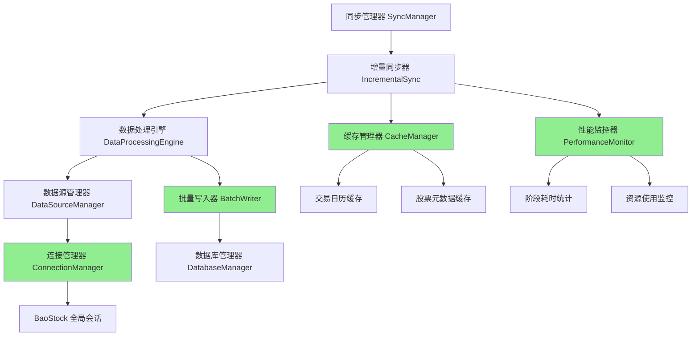
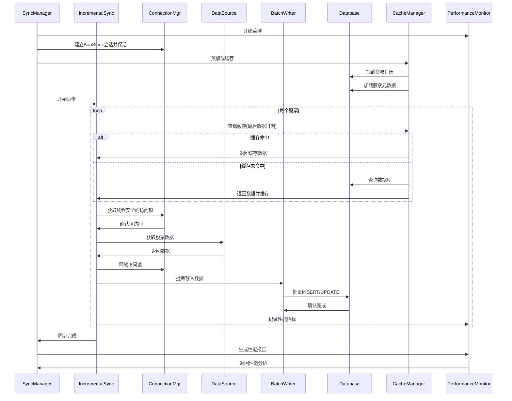

# Design Document

## Overview

sync-optimization 旨在对 SimTradeData 的同步系统进行全面性能优化,通过优化 BaoStock 连接管理、数据库批量操作、并发流水线处理、智能缓存和性能监控五个方面,实现同步速度从当前约 1.2 条/秒提升到 >500 条/秒的业务目标。

本设计遵循零冗余架构原则,所有优化都是对现有模块的增强,不引入新的外部依赖,保持系统的简洁性和可维护性。优化策略采用渐进式实施,每个优化模块都可以独立启用/禁用,确保系统稳定性。

## Steering Document Alignment

### Technical Standards (tech.md)

本设计严格遵循 tech.md 中定义的技术标准:

1. **性能目标** (tech.md 第165-168行):
   - 数据同步速度: >500条/秒 (设计目标)
   - 内存使用: <2GB 正常运行 (设计约束)
   - 并发支持: 多线程查询 (设计实现)

2. **架构原则** (tech.md 第51-55行):
   - 性能优先: 在保证数据完整性前提下优化性能
   - 零冗余: 不引入新的外部依赖
   - 模块化: 每个优化模块独立可配置

3. **代码质量** (tech.md 第93-99行):
   - 测试覆盖率100%
   - 遵循 PEP 8 规范
   - 完整的类型注解

### Project Structure (structure.md)

优化模块按照 structure.md 定义的分层架构组织:

1. **数据源层优化** (`data_sources/`):
   - `connection_manager.py`: BaoStock 连接管理(会话保活、线程安全)

2. **数据库层优化** (`database/`):
   - `batch_writer.py`: 批量写入优化器

3. **性能层新增** (`performance/`):
   - `cache_manager.py`: 缓存管理器 (已存在,增强)
   - `monitor.py`: 性能监控器

4. **同步层增强** (`sync/`):
   - 增强 `incremental.py`: 使用批量写入和缓存
   - 增强 `manager.py`: 集成监控

## Code Reuse Analysis

### Existing Components to Leverage

1. **DatabaseManager** (`database/manager.py`):
   - 现有 `executemany()` 方法: 批量写入的基础
   - WAL 模式已启用 (manager.py:106): 支持并发写入
   - 线程本地连接 (manager.py:72): 支持多线程安全

2. **BaoStockAdapter** (`data_sources/baostock_adapter.py`):
   - `_ensure_connection()` 方法 (adapter.py:80-106): 连接管理基础
   - `_session_timeout` 配置 (adapter.py:30): 超时检测机制
   - `_retry_request()` 方法: 重试机制

3. **IncrementalSync** (`sync/incremental.py`):
   - `_sync_pipeline()` 方法 (incremental.py:898-996): 流水线处理框架
   - 批次配置 (incremental.py:46-50): 批次大小和线程数
   - 智能补充功能 (incremental.py:238-480): 数据质量检查

4. **CacheManager** (`performance/cache_manager.py`):
   - 现有缓存框架: LRU 缓存基础设施
   - 需要扩展支持交易日历和股票元数据缓存

### Integration Points

1. **DataSourceManager**:
   - 集成连接管理器: 优化会话保活和线程安全访问
   - 透明替换: 不改变现有 API

2. **DatabaseManager**:
   - 集成批量写入器: 扩展 `executemany()` 支持事务批量提交
   - 保持向后兼容: 现有代码无需修改

3. **IncrementalSync**:
   - 优化连接管理: 避免频繁重连
   - 使用批量写入: 通过 DatabaseManager 透明使用
   - 使用缓存: 查询前先查缓存

4. **性能监控**:
   - 集成到所有同步流程: 记录关键性能指标
   - 生成报告: 同步完成后生成性能分析报告

## Architecture

本优化采用分层优化策略,从底层连接管理到上层并发调度,全面提升同步性能。

### 分层优化架构



### 性能优化流程



### Modular Design Principles

1. **Single File Responsibility**:
   - `connection_manager.py`: 仅负责连接管理(会话保活、线程安全)
   - `batch_writer.py`: 仅负责批量写入优化
   - `cache_manager.py`: 仅负责缓存管理
   - `monitor.py`: 仅负责性能监控

2. **Component Isolation**:
   - 每个优化模块独立可测试
   - 可通过配置独立启用/禁用
   - 模块间低耦合

3. **Service Layer Separation**:
   - 连接层: ConnectionManager (会话保活、线程安全)
   - 数据访问层: BatchWriter
   - 业务逻辑层: IncrementalSync
   - 监控层: PerformanceMonitor

4. **Utility Modularity**:
   - 缓存工具: LRU 缓存、TTL 缓存
   - 监控工具: 计时器、资源监控器
   - 配置工具: 优化参数推荐器

## Components and Interfaces

### Component 1: ConnectionManager (连接管理器)

**文件**: `simtradedata/data_sources/connection_manager.py`

- **Purpose**: 优化 BaoStock 会话管理,避免频繁重连,提供线程安全的访问控制
- **核心策略**:
  - **会话保活**: BaoStock 使用全局单例会话,避免频繁 login/logout
  - **线程安全**: 使用线程锁保证 API 调用串行化
  - **智能重连**: 只在会话真正超时时重连
  - **心跳检测**: 定期检测会话有效性

- **Interfaces**:
  ```python
  class ConnectionManager:
      def __init__(self, adapter: BaoStockAdapter, session_timeout: int = 600,
                   heartbeat_interval: int = 60)
      def ensure_connected(self) -> bool  # 确保会话有效
      def acquire_lock(self, timeout: float = 10) -> bool  # 获取访问锁
      def release_lock()  # 释放访问锁
      def heartbeat() -> bool  # 心跳检测
      def disconnect()  # 断开连接
      def get_stats() -> Dict[str, Any]  # 获取统计信息
  ```
- **Dependencies**:
  - `BaoStockAdapter`: 用于管理会话
  - `threading.Lock`: 线程安全锁
  - `time`: 超时检测
- **Reuses**:
  - 复用 BaoStockAdapter 的 `connect()` 和 `disconnect()` 方法
  - 复用 `_ensure_connection()` 的超时检测逻辑

**设计细节**:
- **全局会话管理**: BaoStock 使用全局单例,一个进程只维护一个会话
- **线程锁**: 使用 `threading.Lock` 保证多线程串行访问 BaoStock API
- **会话保活**: 长时间保持连接,避免频繁 login/logout (每次需1-2秒)
- **智能重连**: 只在检测到会话超时或 API 错误时才重连
- **心跳机制**: 定期发送轻量级查询验证会话有效性
- **统计信息**: 记录重连次数、平均访问时间等

### Component 2: BatchWriter (批量写入器)

**文件**: `simtradedata/database/batch_writer.py`

- **Purpose**: 优化数据库批量写入性能,减少事务开销,提升大规模同步速度
- **Interfaces**:
  ```python
  class BatchWriter:
      def __init__(self, db_manager: DatabaseManager, batch_size: int = 100)
      def add_record(self, table: str, data: Dict[str, Any])
      def flush(self, table: str = None) -> int
      def flush_all() -> Dict[str, int]
      def execute_batch(self, sql: str, params_list: List[Tuple]) -> int
  ```
- **Dependencies**:
  - `DatabaseManager`: 数据库管理器
  - `collections.defaultdict`: 批次缓冲区
- **Reuses**:
  - 复用 DatabaseManager 的 `executemany()` 方法
  - 复用 `transaction()` 上下文管理器

**设计细节**:
- 内存缓冲区: 按表分组缓冲数据
- 自动刷新: 达到批次大小自动刷新
- 事务批量提交: 减少 fsync 次数
- 错误隔离: 单批失败不影响其他批次
- INSERT OR REPLACE: 支持幂等性

### Component 3: CacheManager Enhancement (缓存管理器增强)

**文件**: `simtradedata/performance/cache_manager.py` (增强现有)

- **Purpose**: 智能缓存交易日历、股票元数据、最后数据日期,减少重复查询
- **Interfaces** (新增):
  ```python
  class CacheManager:
      # 现有方法...

      # 新增方法
      def load_trading_calendar(self, start_date: date, end_date: date)
      def is_trading_day(self, trade_date: date, market: str = 'CN') -> bool
      def get_last_data_date(self, symbol: str, frequency: str = '1d') -> Optional[date]
      def set_last_data_date(self, symbol: str, frequency: str, last_date: date)
      def get_stock_metadata(self, symbol: str) -> Optional[Dict]
      def load_stock_metadata_batch(self, symbols: List[str])
      def get_cache_stats() -> Dict[str, Any]
  ```
- **Dependencies**:
  - `DatabaseManager`: 数据查询
  - `functools.lru_cache`: LRU 缓存
  - `datetime`: 日期处理
- **Reuses**:
  - 现有 CacheManager 基础设施
  - LRU 缓存装饰器

**设计细节**:
- 分层缓存: L1(内存) + L2(可选Redis)
- TTL 过期: 交易日历7天过期,股票元数据1天过期
- 批量预加载: 启动时批量加载常用数据
- 内存控制: LRU 淘汰,限制总大小 <500MB
- 缓存一致性: 数据更新时自动刷新缓存

### Component 4: PerformanceMonitor (性能监控器)

**文件**: `simtradedata/monitoring/performance_monitor.py`

- **Purpose**: 实时监控同步性能,识别瓶颈,生成性能分析报告
- **Interfaces**:
  ```python
  class PerformanceMonitor:
      def __init__(self)
      def start_phase(self, phase_name: str)
      def end_phase(self, phase_name: str, records_count: int = 0)
      def record_metric(self, metric_name: str, value: float)
      def get_phase_stats(self, phase_name: str) -> Dict[str, Any]
      def generate_report(self) -> Dict[str, Any]
      def identify_bottlenecks(self) -> List[Dict[str, Any]]
  ```
- **Dependencies**:
  - `time`: 计时
  - `psutil`: 资源监控 (可选)
  - `collections.defaultdict`: 指标存储
- **Reuses**: 无,新建独立模块

**设计细节**:
- 阶段计时: 记录每个阶段的开始/结束时间
- 资源监控: CPU、内存、磁盘IO
- 吞吐量计算: 记录数/耗时
- 瓶颈识别: 耗时占比 >50% 标记为瓶颈
- 报告格式: JSON 和可读文本两种格式

### Component 5: IncrementalSync Enhancement (增量同步器增强)

**文件**: `simtradedata/sync/incremental.py` (修改现有)

- **Purpose**: 集成所有优化模块,实现高性能增量同步
- **Changes**:
  - 使用连接池: 通过 DataSourceManager 获取
  - 使用批量写入: 替换逐条 UPDATE 为批量写入
  - 使用缓存: 查询前先查缓存
  - 集成监控: 记录各阶段性能
- **Enhanced Methods**:
  - `sync_all_symbols()`: 添加性能监控
  - `smart_backfill_symbol()`: 使用批量写入器
  - `get_last_data_date()`: 使用缓存
  - `_is_trading_day()`: 使用缓存
- **Reuses**:
  - 现有流水线框架 `_sync_pipeline()`
  - 现有配置 `batch_size`, `max_workers`

## Data Models

### ConnectionManagerConfig

连接管理配置模型:

```python
@dataclass
class ConnectionManagerConfig:
    session_timeout: int = 600       # 会话超时(秒)
    heartbeat_interval: int = 60     # 心跳检查间隔(秒)
    lock_timeout: int = 10           # 锁等待超时(秒)
    enable_keepalive: bool = True    # 是否启用会话保活
    enable: bool = True              # 是否启用连接管理优化
```

### BatchWriterConfig

批量写入配置模型:

```python
@dataclass
class BatchWriterConfig:
    batch_size: int = 100        # 批次大小
    auto_flush: bool = True      # 自动刷新
    transaction_mode: str = "immediate"  # 事务模式
    enable: bool = True          # 是否启用批量写入
```

### CacheConfig

缓存配置模型:

```python
@dataclass
class CacheConfig:
    enable: bool = True          # 是否启用缓存
    max_size_mb: int = 500       # 最大缓存大小(MB)
    trading_calendar_ttl: int = 7 * 24 * 3600  # 交易日历TTL(秒)
    stock_metadata_ttl: int = 24 * 3600        # 股票元数据TTL(秒)
    last_data_date_ttl: int = 60               # 最后数据日期TTL(秒)
```

### PerformanceReport

性能报告数据模型:

```python
@dataclass
class PhaseStats:
    name: str                    # 阶段名称
    duration: float              # 耗时(秒)
    records_count: int           # 处理记录数
    throughput: float            # 吞吐量(条/秒)
    cpu_usage: float             # CPU使用率(%)
    memory_usage: float          # 内存使用(MB)

@dataclass
class PerformanceReport:
    total_duration: float        # 总耗时(秒)
    total_records: int           # 总记录数
    overall_throughput: float    # 总吞吐量(条/秒)
    phases: List[PhaseStats]     # 各阶段统计
    bottlenecks: List[str]       # 瓶颈列表
    recommendations: List[str]   # 优化建议
```

## Error Handling

### Error Scenarios

1. **线程访问超时**:
   - **Handling**: 等待获取访问锁(带超时),超时后记录告警并重试
   - **User Impact**: 日志警告,同步速度暂时变慢
   - **Recovery**: 锁释放后自动恢复正常

2. **批量写入失败**:
   - **Handling**: 回滚整个批次,记录错误,回退到逐条写入
   - **User Impact**: 该批次数据重新逐条处理,性能下降
   - **Recovery**: 下一批次恢复批量写入

3. **缓存失效**:
   - **Handling**: 降级到直接查询数据库,记录日志
   - **User Impact**: 性能轻微下降,功能不受影响
   - **Recovery**: 缓存自动重建

4. **性能监控失败**:
   - **Handling**: 捕获异常,跳过监控,不影响同步流程
   - **User Impact**: 无性能报告,同步正常完成
   - **Recovery**: 下次同步恢复监控

5. **内存使用超限**:
   - **Handling**: 动态降低批次大小或线程数,清理缓存
   - **User Impact**: 同步速度降低,但系统保持稳定
   - **Recovery**: 内存恢复后自动调整回优化配置

### 错误处理策略

1. **降级策略**: 优化失败时降级到基础实现
2. **隔离原则**: 单个模块错误不影响其他模块
3. **日志记录**: 详细记录错误上下文,便于诊断
4. **自动恢复**: 错误解决后自动恢复优化状态
5. **用户通知**: 关键错误通过日志告警

## Testing Strategy

### Unit Testing

**测试文件**: `tests/unit/test_sync_optimization.py`

**测试覆盖**:

1. **ConnectionManager 测试**:
   - 会话保活和重连
   - 线程安全锁机制
   - 心跳检测有效性
   - 超时处理
   - 并发安全性

2. **BatchWriter 测试**:
   - 单条记录添加
   - 批次自动刷新
   - 事务回滚
   - 不同表分离
   - 性能对比(批量 vs 逐条)

3. **CacheManager 测试**:
   - 缓存命中/未命中
   - TTL 过期
   - LRU 淘汰
   - 缓存一致性
   - 批量加载

4. **PerformanceMonitor 测试**:
   - 阶段计时准确性
   - 吞吐量计算
   - 瓶颈识别逻辑
   - 报告生成格式

### Integration Testing

**测试文件**: `tests/integration/test_sync_optimization_integrated.py`

**测试场景**:

1. **完整同步流程**:
   - 启动连接管理器
   - 预加载缓存
   - 执行100只股票增量同步
   - 验证数据正确性
   - 检查性能报告

2. **并发同步测试**:
   - 多线程同时同步不同股票
   - 验证线程锁并发安全
   - 验证批量写入并发安全
   - 验证数据一致性

3. **错误恢复测试**:
   - 模拟连接失败,验证重试
   - 模拟批量写入失败,验证降级
   - 模拟缓存失败,验证降级
   - 验证系统最终一致性

4. **性能基准测试**:
   - 对比优化前后同步速度
   - 测量内存使用峰值
   - 验证是否达到 >500条/秒 目标
   - 生成性能对比报告

### Performance Testing

**测试文件**: `tests/performance/test_sync_benchmark.py`

**测试用例**:

1. **小规模测试** (10只股票):
   - 基线: 无优化
   - 优化1: 仅连接管理
   - 优化2: 连接管理 + 批量写入
   - 优化3: 全部优化
   - 对比吞吐量提升

2. **中规模测试** (100只股票):
   - 测量端到端同步时间
   - 测量各阶段耗时占比
   - 识别性能瓶颈
   - 验证内存使用 <1GB

3. **大规模测试** (1000只股票):
   - 压力测试: 长时间运行稳定性
   - 内存峰值测试: 验证 <2GB 约束
   - 并发测试: 不同批次大小和线程数组合
   - 找到最优配置

4. **性能回归测试**:
   - 每次提交自动运行
   - 对比历史性能数据
   - 性能下降 >10% 触发告警

### 测试覆盖率目标

- 单元测试覆盖率: 100%
- 集成测试覆盖率: >90%
- 性能测试: 全场景覆盖
- 压力测试: 5000只股票

## Configuration

### 配置文件更新

在 `config.yaml` 中添加优化配置:

```yaml
# 性能优化配置
performance:
  # 连接管理配置
  connection_manager:
    enable: true
    session_timeout: 600
    heartbeat_interval: 60
    lock_timeout: 10
    enable_keepalive: true

  # 批量写入配置
  batch_writer:
    enable: true
    batch_size: 100
    auto_flush: true
    transaction_mode: immediate

  # 缓存配置
  cache:
    enable: true
    max_size_mb: 500
    trading_calendar_ttl: 604800  # 7天
    stock_metadata_ttl: 86400     # 1天
    last_data_date_ttl: 60        # 60秒

  # 性能监控配置
  monitor:
    enable: true
    detailed_logging: true
    report_format: json
    bottleneck_threshold: 0.5     # 50%

# 同步配置增强
sync:
  batch_size: 50
  max_workers: 3
  enable_parallel: true
  enable_smart_backfill: false
  # 新增: 自适应并发配置
  auto_tune: true
  memory_limit_gb: 1.5
```

### 配置推荐逻辑

根据系统资源自动推荐配置:

```python
def recommend_config(cpu_count: int, memory_gb: float) -> Dict[str, Any]:
    """根据系统资源推荐配置"""
    return {
        'connection_manager.session_timeout': 600,
        'connection_manager.heartbeat_interval': 60,
        'batch_writer.batch_size': min(memory_gb * 50, 200),
        'sync.max_workers': min(cpu_count - 1, 4),
        'sync.batch_size': min(memory_gb * 25, 100),
        'cache.max_size_mb': min(memory_gb * 200, 1000),
    }
```

## Implementation Phases

### Phase 1: 连接管理优化 (优先级: 高)

**工作量**: 2-3天

**任务**:
1. 创建 `ConnectionManager` 类
2. 集成到 `DataSourceManager`
3. 单元测试和集成测试
4. 性能基准测试

**预期提升**: 减少重连开销 30-50%

### Phase 2: 批量写入优化 (优先级: 高)

**工作量**: 2-3天

**任务**:
1. 创建 `BatchWriter` 类
2. 修改 `IncrementalSync.smart_backfill_symbol()`
3. 单元测试和集成测试
4. 性能对比测试

**预期提升**: 批量写入速度提升 5-10倍

### Phase 3: 缓存优化 (优先级: 中)

**工作量**: 2天

**任务**:
1. 增强 `CacheManager`
2. 集成到 `IncrementalSync`
3. 缓存命中率测试
4. 内存使用测试

**预期提升**: 减少数据库查询 60-80%

### Phase 4: 性能监控 (优先级: 中)

**工作量**: 1-2天

**任务**:
1. 创建 `PerformanceMonitor` 类
2. 集成到同步流程
3. 报告生成测试
4. 瓶颈识别验证

**预期提升**: 提供性能可见性,指导后续优化

### Phase 5: 并发优化和调优 (优先级: 低)

**工作量**: 2-3天

**任务**:
1. 自适应并发配置
2. 动态批次大小调整
3. 内存使用监控和控制
4. 全面性能测试

**预期提升**: 最终达到 >500条/秒 目标

### 总工作量估算

- 开发: 9-13天
- 测试: 3-5天
- 文档和调优: 2-3天
- **总计**: 14-21天

## Success Metrics

### 性能指标

1. **同步速度**:
   - 批量模式: 从 1.2条/秒 提升到 >500条/秒 (417倍提升)
   - 逐个模式: 保持 >100条/秒

2. **内存使用**:
   - 正常运行: <500MB
   - 峰值(5000只股票): <1.5GB

3. **响应时间**:
   - 线程锁获取: <10ms
   - 缓存查询命中: <1ms
   - 批量写入100条: <50ms

4. **资源利用率**:
   - CPU利用率: 60-80%
   - 会话利用率: >80%
   - 缓存命中率: >70%

### 质量指标

1. **测试覆盖率**: 100%
2. **数据准确性**: 优化前后数据100%一致
3. **系统稳定性**: 7x24小时稳定运行
4. **错误率**: <0.1%

### 可观测性指标

1. **性能报告**: 每次同步生成详细报告
2. **瓶颈识别**: 自动识别性能瓶颈
3. **优化建议**: 根据实际运行数据给出建议
4. **趋势分析**: 长期性能趋势跟踪

## Risks and Mitigation

### 风险1: 优化可能引入 Bug

**缓解措施**:
- 渐进式实施,每个模块独立测试
- 保留降级开关,可快速回退
- 100%测试覆盖率
- 数据一致性验证

### 风险2: 内存使用可能超限

**缓解措施**:
- 严格的内存限制和监控
- 动态调整批次大小
- LRU 缓存淘汰
- 压力测试验证

### 风险3: 并发安全问题

**缓解措施**:
- 使用线程安全的数据结构
- 充分的并发测试
- WAL 模式支持并发写入
- 事务隔离保证一致性

### 风险4: 性能提升不达预期

**缓解措施**:
- 分阶段性能基准测试
- 及时识别瓶颈并调整
- 预留调优时间
- 必要时调整目标指标
