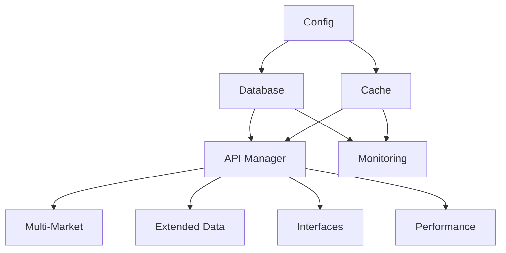

# SimTradeData 开发者指南

## 📖 概述

本指南面向希望参与SimTradeData开发、扩展功能或集成到自己项目中的开发者。涵盖了项目架构、开发环境搭建、代码规范、测试指南和贡献流程。

## 🏗️ 项目架构

### 整体架构

SimTradeData 采用分层模块化架构：

```
SimTradeData/
├── 📁 simtradedata/                    # 核心包
│   ├── 📁 database/                    # 数据库层
│   │   ├── manager.py                  # 数据库管理器
│   │   └── schema.py                   # 数据库架构(11个专用表)
│   ├── 📁 api/                         # API路由层
│   │   ├── router.py                   # 高性能查询路由器
│   │   ├── cache.py                    # 查询缓存
│   │   ├── formatters.py               # 结果格式化器
│   │   └── query_builders.py           # SQL查询构建器
│   ├── 📁 data_sources/                # 数据源层
│   │   ├── manager.py                  # 数据源管理器
│   │   ├── baostock_adapter.py         # BaoStock适配器
│   │   ├── mootdx_adapter.py           # Mootdx适配器
│   │   └── qstock_adapter.py           # QStock适配器
│   ├── 📁 sync/                        # 数据同步层
│   │   ├── manager.py                  # 同步管理器
│   │   ├── incremental.py              # 增量同步
│   │   ├── gap_detector.py             # 缺口检测
│   │   └── validator.py                # 数据验证
│   ├── 📁 preprocessor/                # 数据预处理层
│   │   ├── engine.py                   # 数据处理引擎
│   │   ├── cleaner.py                  # 数据清洗
│   │   ├── converter.py                # 格式转换
│   │   └── indicators.py               # 技术指标
│   ├── 📁 interfaces/                  # 接口层
│   │   ├── ptrade_api.py               # PTrade兼容API
│   │   ├── rest_api.py                 # REST API服务器
│   │   └── api_gateway.py              # API网关
│   ├── 📁 performance/                 # 性能优化层
│   │   ├── query_optimizer.py          # 查询优化器
│   │   └── cache_manager.py            # 缓存管理器
│   ├── 📁 markets/                     # 多市场支持
│   │   ├── multi_market.py             # 多市场管理器
│   │   ├── hk_market.py                # 港股市场
│   │   └── us_market.py                # 美股市场
│   ├── 📁 extended_data/               # 扩展数据
│   │   ├── sector_data.py              # 板块数据
│   │   ├── etf_data.py                 # ETF数据
│   │   └── technical_indicators.py     # 技术指标
│   ├── 📁 monitoring/                  # 监控运维层
│   │   ├── data_quality.py             # 数据质量监控
│   │   ├── alert_system.py             # 告警系统
│   │   └── alert_rules.py              # 告警规则工厂
│   └── 📁 config/                      # 配置管理
│       ├── manager.py                  # 配置管理器
│       ├── defaults.py                 # 默认配置
│       └── production.py               # 生产配置
├── 📁 tests/                           # 测试套件
│   ├── test_api_router.py              # API路由器测试
│   ├── test_sync_basic.py              # 数据同步测试
│   ├── test_database.py                # 数据库测试
│   └── test_integration_simple.py     # 集成测试
├── 📁 docs/                            # 文档
├── 📁 scripts/                         # 工具脚本
└── 📁 examples/                        # 示例代码
```

### 核心设计原则

1. **模块化**: 每个模块职责单一，接口清晰
2. **可扩展**: 支持插件式扩展新功能
3. **高性能**: 多级缓存、并发处理、查询优化（技术指标434x提升）
4. **可靠性**: 错误处理、健康检查、自动恢复、告警系统
5. **可观测**: 全面监控、日志记录、性能分析、数据质量监控

### 依赖关系



### 配置管理

#### 数据源配置

在 `config.yaml` 中配置各个数据源：

```yaml
# 数据源配置
data_sources:
  # 各数据源基本配置
  baostock:
    enabled: true
    timeout: 15
    retry_times: 3
    retry_delay: 2
    rate_limit: 200

  mootdx:
    enabled: true
    timeout: 10
    retry_times: 3
    retry_delay: 1
    rate_limit: 300

  qstock:
    enabled: true
    timeout: 10
    retry_times: 3
    retry_delay: 1
    rate_limit: 150

  # 数据源优先级配置（可选）
  source_priorities:
    # 自定义特定场景的优先级
    "SZ_1d_ohlcv": ["baostock", "qstock", "mootdx"]
    "SS_5m_ohlcv": ["mootdx", "qstock", "baostock"]

  # 其他配置
  max_retry_attempts: 3
  retry_delay: 1
  health_check_interval: 300
```

#### 运行时配置修改

```python
from simtradedata.config import Config

# 创建配置对象
config = Config()

# 动态修改数据源优先级
config.set('data_sources.source_priorities.SZ_1d_ohlcv',
          ['baostock', 'mootdx', 'qstock'])

# 禁用某个数据源
config.set('data_sources.qstock.enabled', False)

# 调整超时时间
config.set('data_sources.baostock.timeout', 30)
```

## 🛠️ 开发环境搭建

### 环境要求

- Python 3.8+
- Poetry (包管理)
- SQLite 3.x
- Git

### 安装步骤

1. **克隆项目**
```bash
git clone <repository-url>
cd SimTradeLab
```

2. **安装Poetry**
```bash
curl -sSL https://install.python-poetry.org | python3 -
```

3. **安装依赖**
```bash
poetry install --with dev
```

4. **激活虚拟环境**
```bash
poetry shell
```

5. **运行测试**
```bash
poetry run pytest
```

### 开发工具配置

#### VS Code配置

创建 `.vscode/settings.json`:
```json
{
    "python.defaultInterpreterPath": ".venv/bin/python",
    "python.linting.enabled": true,
    "python.linting.pylintEnabled": true,
    "python.formatting.provider": "black",
    "python.testing.pytestEnabled": true,
    "python.testing.pytestArgs": ["tests/"]
}
```

#### Pre-commit钩子

```bash
# 安装pre-commit
poetry add --group dev pre-commit

# 安装钩子
pre-commit install
```

创建 `.pre-commit-config.yaml`:
```yaml
repos:
  - repo: https://github.com/psf/black
    rev: 22.3.0
    hooks:
      - id: black
  - repo: https://github.com/pycqa/isort
    rev: 5.10.1
    hooks:
      - id: isort
  - repo: https://github.com/pycqa/flake8
    rev: 4.0.1
    hooks:
      - id: flake8
```

## 📝 代码规范

### Python代码风格

遵循PEP 8规范，使用Black格式化工具：

```python
# 好的示例
class DataManager:
    """数据管理器类"""
    
    def __init__(self, config: Config):
        """初始化数据管理器"""
        self.config = config
        self.cache = {}
    
    def get_data(self, symbol: str, start_date: str, end_date: str) -> pd.DataFrame:
        """获取数据"""
        cache_key = f"{symbol}_{start_date}_{end_date}"
        
        if cache_key in self.cache:
            return self.cache[cache_key]
        
        # 从数据库获取数据
        data = self._fetch_from_database(symbol, start_date, end_date)
        self.cache[cache_key] = data
        
        return data
    
    def _fetch_from_database(self, symbol: str, start_date: str, end_date: str) -> pd.DataFrame:
        """从数据库获取数据（私有方法）"""
        # 实现细节
        pass
```

### 命名规范

- **类名**: PascalCase (如 `DataManager`)
- **函数名**: snake_case (如 `get_data`)
- **变量名**: snake_case (如 `cache_key`)
- **常量名**: UPPER_SNAKE_CASE (如 `DEFAULT_TTL`)
- **私有方法**: 前缀下划线 (如 `_fetch_from_database`)

### 文档字符串

使用Google风格的文档字符串：

```python
def get_stock_data(symbol: str, start_date: str, end_date: str) -> pd.DataFrame:
    """获取股票数据
    
    Args:
        symbol: 股票代码，如'000001.SZ'
        start_date: 开始日期，格式'YYYY-MM-DD'
        end_date: 结束日期，格式'YYYY-MM-DD'
    
    Returns:
        包含股票数据的DataFrame
    
    Raises:
        ValueError: 当日期格式不正确时
        DatabaseError: 当数据库连接失败时
    
    Example:
        >>> data = get_stock_data('000001.SZ', '2024-01-01', '2024-01-31')
        >>> print(data.head())
    """
    pass
```

### 类型注解

使用类型注解提高代码可读性：

```python
from typing import Dict, List, Optional, Union
import pandas as pd

def process_data(
    data: pd.DataFrame,
    config: Dict[str, Any],
    symbols: Optional[List[str]] = None
) -> Union[pd.DataFrame, None]:
    """处理数据"""
    pass
```

## 🧪 测试指南

### 测试结构

```
tests/
├── unit/                 # 单元测试
│   ├── test_database.py
│   ├── test_cache.py
│   └── test_api.py
├── integration/          # 集成测试
│   ├── test_api_integration.py
│   └── test_multi_market.py
├── performance/          # 性能测试
│   └── test_performance.py
├── fixtures/             # 测试数据
│   └── sample_data.py
└── conftest.py          # pytest配置
```

### 编写单元测试

```python
import pytest
import pandas as pd
from unittest.mock import Mock, patch
from simtradedata.api import APIManager

class TestAPIManager:
    """API管理器测试"""
    
    @pytest.fixture
    def mock_db_manager(self):
        """模拟数据库管理器"""
        return Mock()
    
    @pytest.fixture
    def mock_cache_manager(self):
        """模拟缓存管理器"""
        return Mock()
    
    @pytest.fixture
    def api_manager(self, mock_db_manager, mock_cache_manager):
        """API管理器实例"""
        from simtradedata.config import Config
        config = Config()
        return APIManager(mock_db_manager, mock_cache_manager, config)
    
    def test_get_daily_data_success(self, api_manager, mock_db_manager):
        """测试获取日线数据成功"""
        # 准备测试数据
        expected_data = pd.DataFrame({
            'symbol': ['000001.SZ'],
            'trade_date': ['2024-01-20'],
            'close': [10.5]
        })
        mock_db_manager.fetchall.return_value = expected_data.to_dict('records')
        
        # 执行测试
        result = api_manager.get_daily_data('000001.SZ', '2024-01-20', '2024-01-20')
        
        # 验证结果
        assert len(result) == 1
        assert result.iloc[0]['symbol'] == '000001.SZ'
        assert result.iloc[0]['close'] == 10.5
    
    def test_get_daily_data_cache_hit(self, api_manager, mock_cache_manager):
        """测试缓存命中"""
        # 设置缓存返回数据
        cached_data = pd.DataFrame({'symbol': ['000001.SZ'], 'close': [10.5]})
        mock_cache_manager.get.return_value = cached_data
        
        # 执行测试
        result = api_manager.get_daily_data('000001.SZ', '2024-01-20', '2024-01-20')
        
        # 验证缓存被调用
        mock_cache_manager.get.assert_called_once()
        assert len(result) == 1
    
    @patch('simtradedata.api.logger')
    def test_get_daily_data_error_handling(self, mock_logger, api_manager, mock_db_manager):
        """测试错误处理"""
        # 模拟数据库错误
        mock_db_manager.fetchall.side_effect = Exception("Database error")
        
        # 执行测试
        result = api_manager.get_daily_data('000001.SZ', '2024-01-20', '2024-01-20')
        
        # 验证错误处理
        assert result.empty
        mock_logger.error.assert_called_once()
```

### 集成测试

```python
import pytest
import tempfile
from pathlib import Path
from simtradedata.database import DatabaseManager
from simtradedata.cache import CacheManager
from simtradedata.api import APIManager
from simtradedata.config import Config

class TestAPIIntegration:
    """API集成测试"""
    
    @pytest.fixture
    def temp_db(self):
        """临时数据库"""
        with tempfile.NamedTemporaryFile(suffix='.db', delete=False) as f:
            yield f.name
        Path(f.name).unlink(missing_ok=True)
    
    @pytest.fixture
    def integration_setup(self, temp_db):
        """集成测试设置"""
        config = Config()
        config.set('database.path', temp_db)
        
        db_manager = DatabaseManager(config)
        db_manager.connect()
        
        cache_manager = CacheManager(config)
        api_manager = APIManager(db_manager, cache_manager, config)
        
        yield api_manager, db_manager, cache_manager
        
        db_manager.close()
    
    def test_full_data_workflow(self, integration_setup):
        """测试完整数据流程"""
        api_manager, db_manager, cache_manager = integration_setup
        
        # 1. 存储数据
        test_data = pd.DataFrame({
            'symbol': ['000001.SZ'],
            'trade_date': ['2024-01-20'],
            'open': [10.0],
            'high': [10.5],
            'low': [9.8],
            'close': [10.2],
            'volume': [1000000]
        })
        
        success = api_manager.store_daily_data(test_data)
        assert success
        
        # 2. 获取数据（第一次，从数据库）
        result1 = api_manager.get_daily_data('000001.SZ', '2024-01-20', '2024-01-20')
        assert len(result1) == 1
        assert result1.iloc[0]['close'] == 10.2
        
        # 3. 获取数据（第二次，从缓存）
        result2 = api_manager.get_daily_data('000001.SZ', '2024-01-20', '2024-01-20')
        assert len(result2) == 1
        assert result2.iloc[0]['close'] == 10.2
        
        # 4. 验证数据一致性
        pd.testing.assert_frame_equal(result1, result2)
```

### 性能测试

```python
import time
import pytest
from simtradedata.performance import ConcurrentProcessor

class TestPerformance:
    """性能测试"""
    
    def test_concurrent_processing_performance(self):
        """测试并发处理性能"""
        processor = ConcurrentProcessor()
        
        def cpu_intensive_task(n):
            """CPU密集型任务"""
            return sum(i * i for i in range(n))
        
        # 串行执行
        start_time = time.time()
        serial_results = [cpu_intensive_task(1000) for _ in range(10)]
        serial_time = time.time() - start_time
        
        # 并行执行
        start_time = time.time()
        args_list = [(1000,) for _ in range(10)]
        parallel_results = processor.execute_parallel(cpu_intensive_task, args_list)
        parallel_time = time.time() - start_time
        
        # 验证结果正确性
        assert serial_results == parallel_results
        
        # 验证性能提升
        speedup = serial_time / parallel_time
        assert speedup > 1.5  # 至少1.5倍性能提升
        
        processor.stop_workers()
    
    @pytest.mark.benchmark
    def test_cache_performance(self, benchmark):
        """测试缓存性能"""
        from simtradedata.cache import CacheManager
        cache_manager = CacheManager()
        
        def cache_operations():
            # 设置1000个缓存项
            for i in range(1000):
                cache_manager.set(f"key_{i}", f"value_{i}")
            
            # 获取1000个缓存项
            for i in range(1000):
                cache_manager.get(f"key_{i}")
        
        # 基准测试
        result = benchmark(cache_operations)
        assert result is None  # 函数无返回值
```

### 运行测试

```bash
# 运行所有测试
poetry run pytest

# 运行特定测试文件
poetry run pytest tests/test_api.py

# 运行特定测试类
poetry run pytest tests/test_api.py::TestAPIManager

# 运行特定测试方法
poetry run pytest tests/test_api.py::TestAPIManager::test_get_daily_data_success

# 运行测试并生成覆盖率报告
poetry run pytest --cov=simtradedata --cov-report=html

# 运行集成测试
poetry run pytest tests/integration/
```

## 🔧 扩展开发

### 数据源优先级配置

SimTradeData支持多个数据源，并采用优先级机制来确保数据质量和稳定性。

#### 当前数据源优先级（已优化）

| 数据类型 | 第一优先级 | 第二优先级 | 第三优先级 |
|---------|-----------|-----------|-----------|
| OHLCV行情 | BaoStock | Mootdx | QStock |
| 股票信息 | BaoStock | QStock | Mootdx |
| 估值数据 | BaoStock | QStock | - |
| 财务数据 | BaoStock | Mootdx | QStock |
| 交易日历 | BaoStock | - | - |
| 除权除息 | BaoStock | - | - |

#### 优先级设计原则

1. **稳定性第一**: BaoStock数据质量高且稳定，作为首选
2. **性能考量**: Mootdx性能优异，作为第二选择
3. **备用保障**: QStock作为备用，确保数据可用性

#### 修改数据源优先级

在 `simtradedata/data_sources/manager.py` 的 `get_source_priorities` 方法中：

```python
def get_source_priorities(self, market: str, frequency: str, data_type: str) -> List[str]:
    """获取数据源优先级"""

    # 从配置中获取优先级，或使用默认优先级
    priority_config = self._get_config("source_priorities", {})
    key = f"{market}_{frequency}_{data_type}"

    if key in priority_config:
        return priority_config[key]

    # 默认优先级策略
    if data_type == "ohlcv":
        return ["baostock", "mootdx", "qstock"]
    elif data_type == "fundamentals":
        return ["baostock", "mootdx", "qstock"]
    # ... 其他数据类型配置
```

#### 通过配置文件自定义优先级

在 `config.yaml` 中添加：

```yaml
data_sources:
  source_priorities:
    # 自定义深圳市场日线OHLCV数据优先级
    "SZ_1d_ohlcv": ["baostock", "mootdx", "qstock"]
    # 自定义上海市场分钟线数据优先级
    "SS_5m_ohlcv": ["mootdx", "qstock", "baostock"]
```

#### 数据源状态监控

系统提供完整的数据源监控能力：

```python
from simtradedata.data_sources.manager import DataSourceManager
from simtradedata.config import Config

# 创建配置和数据源管理器
config = Config()
dsm = DataSourceManager(config=config)

# 检查所有数据源的健康状态
health_status = dsm.health_check()
if isinstance(health_status, dict) and 'data' in health_status:
    health_data = health_status['data']
else:
    health_data = health_status

for source_name, status in health_data.items():
    print(f"{source_name}: {status['status']} (连接: {status['connected']})")

# 获取可用的数据源列表
available_sources = dsm.get_available_sources()
print(f"可用数据源: {available_sources}")

# 获取系统状态概览
system_status = dsm.get_status()
if isinstance(system_status, dict) and 'data' in system_status:
    status_data = system_status['data']
else:
    status_data = system_status

print(f"总数据源: {status_data['total_sources']}")
print(f"健康数据源: {status_data['healthy_sources']}")
```

#### 数据源故障处理

当某个数据源不可用时，系统会自动使用下一优先级的数据源：

```python
# 获取数据时系统自动处理故障切换
try:
    result = dsm.get_daily_data('000001.SZ', '2024-01-01', '2024-01-31')
    if result.get('success'):
        # 检查实际使用的数据源
        actual_source = result.get('source', '未知')
        print(f"数据来源: {actual_source}")
except Exception as e:
    print(f"所有数据源都不可用: {e}")
```

#### 数据源配置最佳实践

1. **定期监控**: 设置定期健康检查任务
2. **日志记录**: 启用详细的数据源访问日志
3. **性能监控**: 监控各数据源的响应时间和成功率
4. **配置备份**: 确保至少有两个可用的数据源

### 添加新的数据源

1. **创建数据源类**

```python
# simtradedata/data_sources/custom_source.py
from .base import BaseDataSource
import pandas as pd
from typing import Dict, List, Any

class CustomDataSource(BaseDataSource):
    """自定义数据源"""

    def __init__(self, config: Dict[str, Any]):
        super().__init__(config)
        self.api_key = config.get('api_key', '')
        self.base_url = config.get('base_url', '')

    def get_daily_data(self, symbol: str, start_date: str, end_date: str) -> pd.DataFrame:
        """获取日线数据"""
        # 实现数据获取逻辑
        pass

    def get_stock_list(self, market: str = None) -> pd.DataFrame:
        """获取股票列表"""
        # 实现股票列表获取逻辑
        pass

    def is_connected(self) -> bool:
        """检查连接状态"""
        # 实现连接检查逻辑
        return True

    def connect(self):
        """建立连接"""
        # 实现连接逻辑
        pass

    def disconnect(self):
        """断开连接"""
        # 实现断开连接逻辑
        pass

    def get_capabilities(self) -> Dict[str, Any]:
        """获取数据源能力"""
        return {
            'name': 'custom',
            'enabled': True,
            'supports_daily': True,
            'supports_minute': False,
            'supported_markets': ['SZ', 'SS'],
            'rate_limit': 100
        }
```

2. **注册数据源**

修改 `simtradedata/data_sources/manager.py` 中的 `_register_adapters` 方法：

```python
def _register_adapters(self):
    """注册数据源适配器"""
    from .custom_source import CustomDataSource

    self.adapter_classes = {
        "baostock": BaoStockAdapter,
        "mootdx": MootdxAdapter,
        "qstock": QStockAdapter,
        "custom": CustomDataSource,  # 添加自定义数据源
    }
```

3. **配置数据源**

在 `config.yaml` 中添加配置：

```yaml
data_sources:
  custom:
    enabled: true
    api_key: 'your_api_key'
    base_url: 'https://api.example.com'
    timeout: 10
    retry_times: 3
    rate_limit: 100
```

或通过代码配置：

```python
from simtradedata.config import Config

config = Config()
config.set('data_sources.custom.enabled', True)
config.set('data_sources.custom.api_key', 'your_api_key')
config.set('data_sources.custom.base_url', 'https://api.example.com')
```

### 添加新的接口

1. **创建接口类**

```python
# simtradedata/interfaces/grpc_server.py
import grpc
from concurrent import futures
from .base import BaseInterface

class GRPCServer(BaseInterface):
    """gRPC服务器"""
    
    def __init__(self, api_manager, config):
        super().__init__(api_manager, config)
        self.server = None
    
    def start(self):
        """启动服务器"""
        self.server = grpc.server(futures.ThreadPoolExecutor(max_workers=10))
        # 添加服务
        self.server.add_insecure_port(f"[::]:{self.config.get('grpc.port', 50051)}")
        self.server.start()
    
    def stop(self):
        """停止服务器"""
        if self.server:
            self.server.stop(0)
```

2. **实现服务方法**

```python
# 定义protobuf服务
# stock_service.proto
syntax = "proto3";

service StockService {
    rpc GetStockData(StockRequest) returns (StockResponse);
}

message StockRequest {
    string symbol = 1;
    string start_date = 2;
    string end_date = 3;
}

message StockResponse {
    repeated StockData data = 1;
}

message StockData {
    string symbol = 1;
    string trade_date = 2;
    double close = 3;
}
```

### 添加新的监控指标

#### 高级告警系统扩展

SimTradeData提供完整的告警系统，支持自定义告警规则。

**1. 创建自定义告警规则**

```python
from simtradedata.monitoring import AlertRule, AlertSeverity

def custom_check_function():
    """自定义检查函数"""
    # 实现你的检查逻辑
    # 返回None表示无告警，返回Dict表示触发告警

    # 示例：检查数据更新时间
    from datetime import datetime, timedelta
    last_update = get_last_update_time()  # 你的逻辑

    if datetime.now() - last_update > timedelta(hours=24):
        return {
            "message": f"数据已{(datetime.now() - last_update).days}天未更新",
            "details": {
                "last_update": last_update.isoformat(),
                "current_time": datetime.now().isoformat()
            }
        }

    return None  # 无告警

# 创建告警规则
custom_rule = AlertRule(
    rule_id="custom_update_check",
    name="数据更新检查",
    check_func=custom_check_function,
    severity=AlertSeverity.HIGH,
    enabled=True,
    cooldown_minutes=60,  # 1小时内不重复告警
    description="检查数据是否按时更新"
)

# 添加到告警系统
from simtradedata.monitoring import AlertSystem
alert_system = AlertSystem(db_manager)
alert_system.add_rule(custom_rule)
```

**2. 创建告警规则工厂方法**

```python
# 在 simtradedata/monitoring/alert_rules.py 中添加

@staticmethod
def create_custom_rule(
    db_manager: DatabaseManager,
    threshold: float = 100.0,
    cooldown_minutes: int = 60
) -> AlertRule:
    """创建自定义告警规则

    Args:
        db_manager: 数据库管理器
        threshold: 告警阈值
        cooldown_minutes: 冷却时间（分钟）

    Returns:
        AlertRule: 告警规则
    """
    def check_func():
        try:
            # 实现检查逻辑
            sql = "SELECT COUNT(*) as count FROM your_table WHERE condition"
            result = db_manager.fetchone(sql)
            count = result["count"] if result else 0

            if count > threshold:
                return {
                    "message": f"检测到{count}条异常记录（阈值: {threshold}）",
                    "details": {"count": count, "threshold": threshold}
                }
        except Exception as e:
            logger.error(f"自定义检查失败: {e}")

        return None

    return AlertRule(
        rule_id="custom_check",
        name="自定义检查",
        check_func=check_func,
        severity=AlertSeverity.MEDIUM,
        cooldown_minutes=cooldown_minutes,
        description=f"当记录数超过{threshold}时告警"
    )
```

**3. 创建自定义通知器**

```python
from simtradedata.monitoring import AlertNotifier

class EmailNotifier(AlertNotifier):
    """邮件通知器"""

    def __init__(self, smtp_config):
        self.smtp_host = smtp_config.get('host')
        self.smtp_port = smtp_config.get('port')
        self.from_email = smtp_config.get('from')
        self.to_emails = smtp_config.get('to')

    def send(self, alert: Dict[str, Any]) -> bool:
        """发送邮件告警"""
        try:
            import smtplib
            from email.mime.text import MIMEText

            subject = f"[{alert['severity']}] {alert['rule_name']}"
            body = f"""
            告警消息: {alert['message']}

            详细信息:
            {json.dumps(alert['details'], indent=2, ensure_ascii=False)}

            触发时间: {alert['timestamp']}
            """

            msg = MIMEText(body, 'plain', 'utf-8')
            msg['Subject'] = subject
            msg['From'] = self.from_email
            msg['To'] = ', '.join(self.to_emails)

            with smtplib.SMTP(self.smtp_host, self.smtp_port) as server:
                server.send_message(msg)

            return True
        except Exception as e:
            logger.error(f"邮件发送失败: {e}")
            return False

# 使用自定义通知器
email_config = {
    'host': 'smtp.example.com',
    'port': 587,
    'from': 'alert@example.com',
    'to': ['admin@example.com']
}

alert_system = AlertSystem(db_manager)
alert_system.add_notifier(EmailNotifier(email_config))
```

**4. 内置告警规则说明**

SimTradeData提供6个内置告警规则：

| 规则ID | 名称 | 严重程度 | 默认阈值 | 说明 |
|--------|------|---------|---------|------|
| data_quality_check | 数据质量检查 | MEDIUM | 80.0 | 数据质量评分低于阈值时告警 |
| sync_failure_check | 同步失败检查 | HIGH | 20% | 同步失败率超过阈值时告警 |
| database_size_check | 数据库大小检查 | MEDIUM | 10GB | 数据库超过大小限制时告警 |
| missing_data_check | 数据缺失检查 | MEDIUM | 10% | 股票数据缺失率超过阈值时告警 |
| stale_data_check | 陈旧数据检查 | HIGH | 7天 | 数据未更新超过指定天数时告警 |
| duplicate_data_check | 重复数据检查 | LOW | - | 发现重复记录时告警 |

**5. 告警管理API**

```python
# 查看所有激活的告警
active_alerts = alert_system.history.get_active_alerts()

# 查看特定严重程度的告警
high_alerts = alert_system.history.get_active_alerts(severity="HIGH")

# 确认告警
alert_system.history.acknowledge_alert(alert_id)

# 解决告警
alert_system.history.resolve_alert(alert_id)

# 获取告警统计
stats = alert_system.history.get_alert_statistics()
print(f"总告警数: {stats['total_alerts']}")
print(f"高严重度: {stats['by_severity']['HIGH']}")
print(f"平均响应时间: {stats['avg_acknowledgement_time_minutes']}分钟")

# 获取告警摘要
summary = alert_system.get_alert_summary()
print(f"激活告警: {summary['active_alerts_count']}")
print(f"启用规则: {summary['enabled_rules']}/{summary['total_rules']}")
```

#### 数据质量监控扩展

**1. 自定义质量评分规则**

```python
from simtradedata.monitoring import DataQualityMonitor

class CustomQualityMonitor(DataQualityMonitor):
    """自定义数据质量监控器"""

    def evaluate_custom_quality(self, symbol: str, date_range: tuple) -> float:
        """评估自定义质量指标"""
        # 实现自定义质量评分逻辑
        completeness = self._check_completeness(symbol, date_range)
        accuracy = self._check_accuracy(symbol, date_range)
        timeliness = self._check_timeliness(symbol, date_range)

        # 加权计算总分
        quality_score = (
            completeness * 0.4 +
            accuracy * 0.4 +
            timeliness * 0.2
        )

        return quality_score
```

### 添加新的监控指标

1. **创建自定义收集器**

```python
# simtradedata/monitoring/custom_collector.py
from .base import MetricCollector

class CustomMetricCollector(MetricCollector):
    """自定义指标收集器"""
    
    def collect_metrics(self) -> Dict[str, float]:
        """收集自定义指标"""
        return {
            'custom_metric_1': self._get_custom_metric_1(),
            'custom_metric_2': self._get_custom_metric_2(),
        }
    
    def _get_custom_metric_1(self) -> float:
        """获取自定义指标1"""
        # 实现指标收集逻辑
        pass
```

2. **注册收集器**

```python
from simtradedata.monitoring import PerformanceMonitor

monitor = PerformanceMonitor()
monitor.add_custom_collector('custom', CustomMetricCollector())
```

## 🚀 部署指南

### 生产环境配置

SimTradeData提供完整的生产环境配置支持。详细信息请参考 [生产部署指南](PRODUCTION_DEPLOYMENT_GUIDE.md)。

**快速启用生产配置：**

```python
from simtradedata.config import Config

# 创建配置并启用生产模式
config = Config()
config.use_production_config = True  # 自动应用生产优化

# 或者通过配置文件
# config.yaml:
# use_production_config: true
```

**生产配置特性：**

1. **数据库优化**
   - SQLite WAL模式（Write-Ahead Logging）
   - 64MB缓存
   - 256MB内存映射
   - 并发性能优化

2. **日志系统**
   - 结构化日志（JSON格式）
   - 日志分级（错误日志独立）
   - 性能日志独立监控
   - 自动日志轮转

3. **性能调优**
   - 查询缓存（600秒TTL）
   - 技术指标缓存（434x性能提升）
   - 并发查询能力（150+ QPS）

4. **监控告警**
   - 6个内置告警规则
   - 自动健康检查
   - 告警历史和统计

**自定义生产配置：**

```python
# custom_production.py
from simtradedata.config import Config, get_production_config

def create_production_config():
    config = Config()

    # 加载生产基础配置
    prod_config = get_production_config()

    # 自定义数据库配置
    config.set('database.path', '/data/simtradedata.db')
    config.set('database.pragma.cache_size', -128000)  # 128MB缓存

    # 自定义缓存配置
    config.set('cache.ttl', 600)  # 10分钟
    config.set('cache.max_size', 20000)

    # 自定义API配置
    config.set('api.host', '0.0.0.0')
    config.set('api.port', 8080)
    config.set('api.workers', 4)

    # 启用监控告警
    config.set('monitoring.enabled', True)
    config.set('monitoring.alert_enabled', True)

    # 日志配置
    config.set('logging.level', 'WARNING')
    config.set('logging.file_path', '/var/log/simtradedata/simtradedata.log')
    config.set('logging.structured_logging', True)

    return config
```

### 生产环境部署步骤

详细步骤请参考 [生产部署指南](PRODUCTION_DEPLOYMENT_GUIDE.md)，快速步骤如下：

```bash
# 1. 克隆项目
git clone <repo> /opt/simtradedata/app
cd /opt/simtradedata/app

# 2. 安装依赖
poetry install --no-dev

# 3. 配置生产环境
cp config.example.yaml config.yaml
# 编辑 config.yaml，设置 use_production_config: true

# 4. 初始化数据库
poetry run python -m simtradedata.cli init

# 5. 配置systemd服务
sudo cp systemd/simtradedata.service /etc/systemd/system/
sudo systemctl enable simtradedata
sudo systemctl start simtradedata

# 6. 验证部署
sudo systemctl status simtradedata
```

### Docker部署

```dockerfile
# Dockerfile
FROM python:3.9-slim

WORKDIR /app

# 安装系统依赖
RUN apt-get update && apt-get install -y \
    gcc \
    && rm -rf /var/lib/apt/lists/*

# 安装Python依赖
COPY pyproject.toml poetry.lock ./
RUN pip install poetry && \
    poetry config virtualenvs.create false && \
    poetry install --only=main

# 复制应用代码
COPY simtradedata/ ./simtradedata/
COPY examples/ ./examples/

# 创建数据目录
RUN mkdir -p /data /var/log

# 暴露端口
EXPOSE 8080

# 启动应用
CMD ["python", "-m", "simtradedata.server"]
```

```yaml
# docker-compose.yml
version: '3.8'

services:
  ptrade-cache:
    build: .
    ports:
      - "8080:8080"
    volumes:
      - ./data:/data
      - ./logs:/var/log
    environment:
      - PTRADE_CONFIG_FILE=/app/production_config.py
    restart: unless-stopped
    
  nginx:
    image: nginx:alpine
    ports:
      - "80:80"
    volumes:
      - ./nginx.conf:/etc/nginx/nginx.conf
    depends_on:
      - ptrade-cache
    restart: unless-stopped
```

## 🤝 贡献指南

### 贡献流程

1. **Fork项目**
2. **创建功能分支**: `git checkout -b feature/new-feature`
3. **提交更改**: `git commit -am 'Add new feature'`
4. **推送分支**: `git push origin feature/new-feature`
5. **创建Pull Request**

### 代码审查

所有代码更改都需要通过代码审查：

- 代码风格符合项目规范
- 包含适当的测试
- 文档更新完整
- 性能影响评估
- 安全性检查

### 发布流程

1. **版本号管理**: 使用语义化版本控制
2. **变更日志**: 更新CHANGELOG.md
3. **标签发布**: `git tag v1.0.0`
4. **自动化测试**: CI/CD流水线验证
5. **文档更新**: 同步更新文档

---

*SimTradeData Developer Guide - 开发者完整指南*
